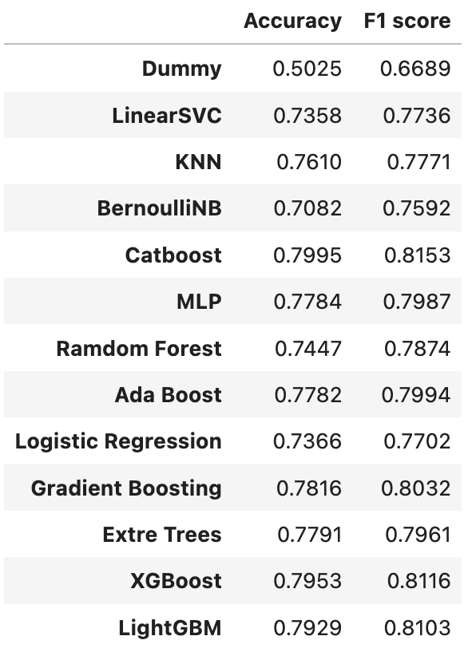

# 9417-Rambling-TracHack
COMP9417 TracHack Porject by group The Rambling 

## model_selection.py 
contains all 12 models run on the preprocessed and their evaluations.

consists of three part:
  - Import and split preprocessed data
  - 12 Models implementations
  - Evaluations by accuracy score, F1 score

Usage: after running data_preprocessing.py, which output the scv files for preprocessed data, run model_selection.py will generate the following result table.

  